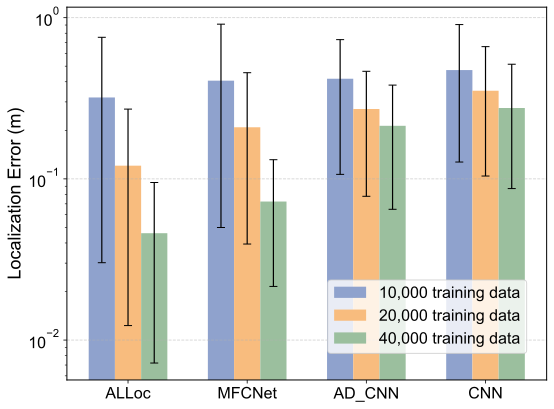
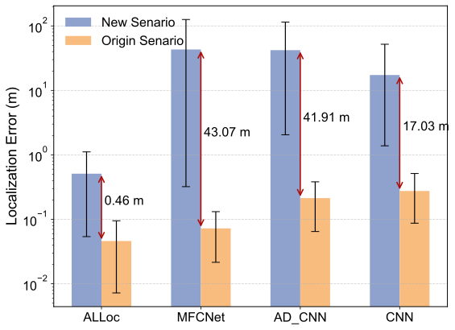
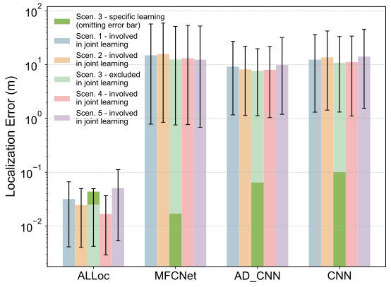
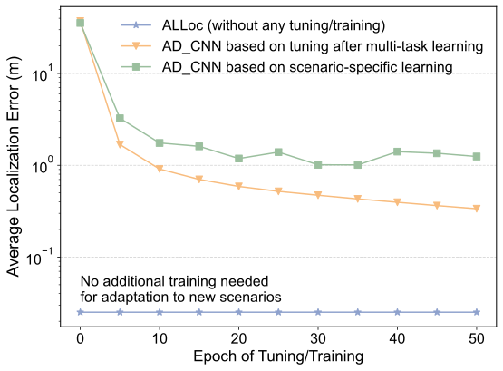

## Analogical Learning-Based Wireless Localization (ALLoc)

Zirui Chen, Zhaoyang Zhang, Ziqing Xing, Ridong Li, Zhaohui Yang, Richeng Jin, Chongwen Huang, Yuzhi Yang and Mérouane Debbah

------

This repository is the official implementation of paper [Analogical Learning for Cross-Scenario Generalization: Framework and Application to Intelligent Localization](https://arxiv.org/abs/2504.08811). All experimental results presented in this paper can be reproduced using this project. 

### Overview of this work

This work proposes a new framework called ***Analogical Learning*** (AL). It enables direct adaptation to diverse scattering environments and system configurations without requiring additional training, offering a new technical system with cross-scenario generalization for intelligent wireless localization and various other wireless AI tasks. This breakthrough stems from a key insight into the relativity of numerical feature representations: isolated numerical values generally cannot convey complete meaning unless combined with corresponding reference frame information. The lack of ability to aware reference system information restricts existing wireless AI methods (e.g., data-to-label learning) to generalizing only within specific underlying reference systems, resulting in poor cross-scenario reusability and high sensitivity to dynamic environmental changes.

Therefore, to complement reference frame information, AL first embeds known data-label pairs from the current scenario as reference objects in the training and inference process, resembling the in-context learning (ICL) in the expression form. The most notable innovation lies in the development of ***Mateformer***, inspired by the insight of relativity. This network designs an advanced multi-layer analogical mechanism, enabling the interpretation of feature information through multi-space relativity and fully leveraging reference frame information. The application of AL to wireless localization demonstrates its superiority: it achieves **state-of-the-art accuracy**, **stable transferability**, and **seamless adaptation to new scenarios without any tuning**, outperforming conventional methods by nearly two orders of magnitude in precision. This expansion of wireless intelligence in multi-scenario dimension marks an important step toward [wireless big AI models](https://ieeexplore.ieee.org/document/10579546).


### Main results

<table>
  <tr>
    <td align="center">
      <br>
      <sub>Performance under a single scenario</sub>
    </td>
    <td align="center">
      <br>
      <sub>Performance of direct cross-scenario reuse</sub>
    </td>
  </tr>
  <tr>
    <td align="center">
      <br>
      <sub>Performance of multi-scenario joint learning and new scenario generalization</sub>
    </td>
    <td align="center">
      <br>
      <sub>Performance comparisons between ALLoc and conventional new scenario tuning/training</sub>
    </td>
  </tr>
</table>


### Usages

#### Environment requirements

To ensure dataset partitioning and expansion, approximately 1TB of storage space is required. We train the Mateformer on the Nvidia Hopper architecture, requiring around 50GB of GPU memory (both the model and data are based on float32). If the device has insufficient memory, the `batch_size` parameter in the code can be appropriately reduced (default `batch_size=500`).
For detailed library dependencies, please refer to `requirements.txt`.

#### Dataset

This work is based on the [DeepMIMO dataset](https://arxiv.org/abs/1902.06435) (V1), filtering out samples with zero or excessively small channel amplitudes, as such samples cannot be collected in real-world systems. To facilitate deep learning, we restructured the data format and implemented a fast data loading interface in the code. The restructured dataset can be downloaded via the following links. 

*Google Driven*: https://drive.google.com/drive/folders/1xSo7-liilx3idr70h8hBdGOeegGFXRHO?usp=drive_link

*Baidu Netdisk*: https://pan.baidu.com/s/11v5ZAaIlNzta3aD7axZpbQ?pwd=f7a4

After downloading the data, please place these compressed files in the `ALLoc` folder (as a `/Data` subfolder), and run `bash decompress.sh` inside the `/Data` subfolder to decompress them.

#### Training and Testing

The overall file structure of the repository is as shown in the `directory_structure.txt` file. 

- The `/O1` and `/O1B` folders correspond to the **Single-Scenario Learning and Generalization** section in the text.
- The `/transfer_O1model_to_O1Btest` and `/transfer_O1model_to_O1Btest` folders correspond to the **Cross-Scenario Learning and Generalization** section (thus requiring the models in `/O1` and `/O1B` to be trained first).
- The `/MO1` folder corresponds to the **Multi-Scenario Learning and Generalization** section.

Within each scenario, the project is implemented in a parallel folder structure. For example, the main differences between `/train10000` and `/train20000` are the amount of training data, while the rest of the code remains nearly consistent.

Before running the code, it is needed to replace the file and data paths from our hardcoded paths to the new current directory. You can do this by running `bash pathchange.sh` using the main folder as the working directory. We also provide several `.sh` script programs to help you quickly run experiments and better understand the relationships between these files.

To complete data generation, training, and testing of ALLoc in O1 scenario (with 40,000 training data), simply run `bash single_scenario_O1.sh`. 

In `single_scenario_O1.sh`:
- `datadivision.py` is used to randomly choice a subset from the original channel-location pairs of DeepMIMO as the training and testing datasets for the localization task.
- `datadivision_sequence.py` is used to construct the neighborhood sampling sequence for each sample based on the channel-location pairs in the training set.
- `datadivision_test_error_len64.py` is used to search the training set for neighborhood sampling sequences required for inference on the test set samples, leveraging coarse location information.
- `train.py` and `test.py` are responsible for training and testing ALLoc, respectively.

(We provide all model files, so testing can be performed directly without training. If you need to reproduce the training process, simply uncomment the line `python train.py` in the `single_scenario_O1.sh` script.)

To complete data generation, training, and testing of ALLoc in O1B scenario (with 40,000 training data points), simply run `bash single_scenario_O1B.sh`. This script is nearly identical to `single_scenario_O1.sh`, with only changes in the scenario parameters.

After running `single_scenario_O1.sh`, you can proceed with cross-scenario performance testing. Navigate to the `/transfer_O1model_to_O1Btest/train40000/Proposed/Scheme/direct_test` directory and run `python test.py`.

To complete data generation, training, and testing of ALLoc in MO1 scenario, simply run `bash multi_scenario.sh`. The code logic in this script is nearly consistent with `single_scenario_O1.sh`, except that the specific `.py` files include data from five scenarios.

For other parts of training and testing, you can infer the process from the file names. When running these scripts, please use the respective subdirectory as the working directory instead of the entire `ALLoc` directory.

### Additional Experiments under Changing Weather or Traffic Conditions

In addition to the experiments mentioned above, we have included experimental evaluations under dynamic weather or traffic conditions, which corresponds to the subsection "Localization under changing weather and traffic conditions".

**Environment requirements**: Completing the experiments for RO1 scenario requires approximately 0.7 TB of storage space, while O2 part of the experiments requires about 2.1 TB. No other changes to the environmental requirements are needed.

**Dataset**: This part of the experiment is based on the [DeepMIMO dataset](https://www.deepmimo.net/) (V2), where RO1 data is generated by adding rain attenuation to the O1_60 dataset according to [ITU-R P.838-3](https://www.itu.int/rec/r-rec-p.838-3-200503-i). The datasets used can be downloaded via the following links. After the download is complete, please place all compressed files into the same folder and run `bash decompress.sh`. This will create an `/ALLoc_usecase_data_share` folder. Move all subfolders and files from this directory to the `/Data/ALLoc_data_share/` directory of your project.

*Google Driven*: https://drive.google.com/drive/folders/1rw7tG-dOscqEmqcBnyJL1HCO7bZEC09n?usp=sharing

*Baidu Netdisk*: https://pan.baidu.com/s/1aj_hUETFRCOIa2lROPii4Q?pwd=e4cd

**Training and Testing**：Similarly, before running the code, it is necessary to replace the hardcoded file and data paths with the new current directory. You can do this by running `bash pathchange.sh` from the main folder as the working directory again. Next, to complete the data generation, training, and testing of ALLoc in RO1 and O2 scenarios, simply run `bash rain_scenario.sh` or `bash road_scenario.sh`, respectively.

### Citation

If you find this work useful in your research, please consider citing us:

```
@article{chen2025AL,
  title={Analogical Learning for Cross-Scenario Generalization: Framework and Application to Intelligent Localization},
  author={Chen, Zirui and Zhang, Zhaoyang and Xing, Ziqing and Li, Ridong and Yang, Zhaohui and Jin, Richeng and Huang, Chongwen and Yang, Yuzhi and Debbah, Mérouane},
  journal={arXiv preprint arXiv:2504.08811},
  year={2025}
}
```

### Contact information

For help or issues using ALLoc, please submit a GitHub issue. For personal communication related to AL, please contact Zirui Chen ([ziruichen@zju.edu.cn](mailto:ziruichen@zju.edu.cn)) or Zhaoyang Zhang (ning_ming@zju.edu.cn).
